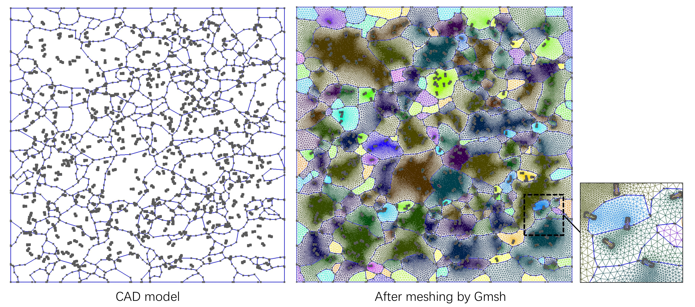

# MetalCAD

 

An **OOP CAD Core** for **Metal Microstructure** 

### Features
- Grain information from [MTEX Toolbox](ghttps://mtex-toolbox.github.io) to CAD geometry
- Particle images from SEM to CAD geometry
- Boolean the grain geometry by particle geometry

### Prerequisite
- [MTEX Toolbox](https://mtex-toolbox.github.io/download) (Developed with **Version 5.11.2**) 
- MATLAB Image Processing Toolbox
- Gmsh (Directly download the executable)

### Example
- The first typical example: grain structure with randomly distributed particles (See .\example\grains_with_particles\test.m)

 

- More examples and utilities will be developed!
### Citation
Coming soon!